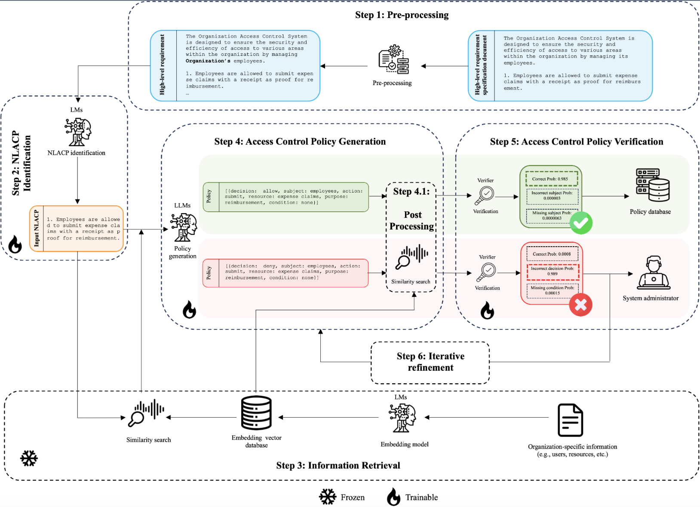

# RAGentV: Retrieval-based Access Control Policy Generation

<!-- Demo  <a target="_blank" href="https://colab.research.google.com/drive/1QlG_XXEvTwejCHDaUQSDMkoQWBKNn97d">
  
</a> -->

Code repository for the paper "RAGentV: Retrieval-based Access Control Policy Generation". RAGentV is a framework developed to using language models and large language models to,

* Identify natural languge policies (NLACPs) from high-level requirement specification documents of an organization (using [BERT LM](https://huggingface.co/docs/transformers/model_doc/bert#transformers.BertModel))
* Retrieves organization-specific information (e.g., subjects, actions, resources, purposes, and conditions) pre-defined in the system that is relevant to translate the NLACPs via dense retrieval.
* Translate identified NLACPs into structured representations through Retrieval Augmented Generation (RAG) seperating access control rules (ACRs) with five policy components: subjects, actions, resources, purposes, and conditions (using [LLaMa 3 8B Instruct](https://huggingface.co/meta-llama/Meta-Llama-3-8B))
* Automatically verify the generated structured representations and provide feedback if the representation is incorrect, mentioning the reason/error (using [BART LM](https://huggingface.co/facebook/bart-large)).
* Based on the verification result, iteratively refines the incorrect policy maximum ```n``` times until the verification result indicates **correct**.
* Even after ```n``` rounds, if the verifier still finds the policy is incorrect, it will be sent back to the administrator for manual refinement before applying it to the authorization system.

By developing this framework we improves the reliability of automated policy generation process and, in turn, reduce the data breaches due to access control failures in the future.



#### Demo

The provided demo with HotCRP privacy policies can be run in the terminal using the following commands.

```bash
$ git clone https://github.com/accessframework/RAGent.git
$ cd RAGent/demo
$ ./demo.sh
```
The results including the final generations and intermediate generations if the refinement is involved will be saved in the ```demo``` directory.

## Setup
### Installation
Clone the repository
```bash
$ git clone https://github.com/accessframework/RAGent.git
$ cd RAGent/
```
(Recommended) Create a new python virtual environment
```bash
$ python3 -m venv .venv
$ source .venv/bin/activate
```
Install the dependencies
```bash
$ pip install -r requirements.txt
```

> NOTE : All the parts of the framework were only tested on Ubuntu machine with NVIDIA A100-SXM4-80GB GPU and 1007G memory. 

### Checkpoints

Download the checkpoints necessary to reproduce the results.

```bash
$ gdown --folder https://drive.google.com/drive/folders/1-kcQZEEU0ZMcH7PakNSF-87YiqY9A8Xx
```

## Inference

The easiest way to reproduce the results reported in the paper is to run the trained models on the prepared datasets used in the paper. To this end, we will explain how to run the models for each step of the framework in the following sections.
### NLACP Identification

To reproduce the results for NLACP identification step, run the following commands with `<mode> = [collected|ibm|t2p|acre|cyber|overall]`

```bash
$ cd identification/
$ python evaluate_classification.py --mode=<mode>
```

Options:
```
$ python evaluate_classification.py --help
Usage: evaluate_classification.py [OPTIONS]

Evaluates RAGent for NLACP identification module.

Options:
  --mode [t2p|acre|ibm|collected|cyber|overall]
                                  Mode of training (document-fold you want to evaluate the trained model on) [default: t2p; required]
```

### Access control policy generation

We have provided the vectorstores needed for the policy generation in ```data/vectorstores```.

When evaluating the proposed framework's ability to generate structured representations from the identified NLACP, we follow two main approaches as mentioned in the paper.

1. **Access control policy component extraction**: Evaluating its ability to extract policy components from NLACPs
    * SAR : Extracting subjects and resources for each action (to compare with previous research as they cannot extract any other components)
    * DSARCP : By going beyond all the existing frameworks, extracting access decision, subjects, resources, purposes, and conditions for each action

2. **Access control rule generation**: Evaluating its ability to generate ACRs directly from NLACPs (NOTE: Each ACR should contain its own access decision (which is not considered in existing frameworks), subject, action, resource, purpose and condition)

#### SAR Evaluation

To reproduce the results under SAR setting as reported in the paper, either load the model utilizing the downloaded checkpoints and evaluate on the dataset using the following commands with `<mode> = [collected|ibm|t2p|acre|cyber]`

```bash
$ cd generation/evaluation/
$ python eval_ragentv_sar.py --mode=<mode>
```

Options:
```
$ python eval_ragentv_sar.py --help
Usage: eval_ragentv_sar.py [OPTIONS]

  Evaluates RAGent in SAR setting.

Options:
  --mode [t2p|acre|ibm|collected|cyber|overall]
                                  Mode of training (document-fold you want to
                                  evaluate the trained model on)  [default:
                                  ibm; required]
  --result_dir TEXT               Directory to save evaluation results
                                  [default: results/eval/sar/]
  --use_pipe                      Whether or not the transformers pipeline to
                                  use for generation
  --help                          Show this message and exit.
```

Or

use the pre-saved entities for each document-fold to generate the comparison between our framework and the related frameworks by running the following command.

```bash
$ python generate_comparison.py
```

#### DSARCP Evaluation 

To reproduce the results reported under the DSARCP setting (i.e., component extraction) and ACR generation from NLACPs by loading the checkpoints, run the following command with `<mode> = [collected|ibm|t2p|acre|cyber|overall]`.

```bash
$ cd generation/evaluation/
$ python eval_ragentv.py --mode=<mode> --refine
```

Options:
```
$ python eval_ragentv.py --help
Usage: eval_ragentv.py [OPTIONS]

  Evaluates RAGent in DSARCP setting.

Options:
  --mode [t2p|acre|ibm|collected|cyber|overall]
                                  Mode of training (document-fold you want to
                                  evaluate the trained model on)  [default:
                                  ibm; required]
  --result_dir TEXT               Directory to save evaluation results
                                  [default: results/sarcp/]
  --n INTEGER                     Number of entities to retrieve per each
                                  component  [default: 5]
  --refine                        Whether to conduct the verification and
                                  iterative refinement
  --no_retrieve                   Whether to retrieve information
  --no_update                     Whether to conduct the post-processing with
                                  retrieved information
  --use_pipe                      Whether or not the transformers pipeline to
                                  use for generation
  --help                          Show this message and exit.
```

After running the above command it will result in two F1 scores, one showing the ability to extract components, and the other showing the ability to generate ACRs. 

### Access control policy verification

To train and evaluate the BART model across multiple random train, validation, and test sets run the following.

```
$ python train_test_verifier_multi_split.py
```
Options:
```
$ python train_test_verifier_multi_split.py --help
Usage: train_test_verifier_multi_split.py [OPTIONS]

  Trains and tests the access control policy verifier using multiple random
  train, validation, test splits

Options:
  --dataset_path TEXT     Location of the generated verification dataset
                          [default: ../data/verification/verification_dataset_
                          json_sent.csv; required]
  --train_epochs INTEGER  Number of epochs to train  [default: 10]
  --learning_rate FLOAT   Learning rate  [default: 2e-05]
  --batch_size INTEGER    Batch size  [default: 8]
  --out_dir TEXT          Output directory  [default:
                          ../checkpoints/verification_json/bart/sent_kfold]
  --k INTEGER             Number of splits  [default: 3]
  --help                  Show this message and exit.
```

>NOTE: This step is carried out to check the ability of BART to verify policies after fine-tuning. Not to create the final verifier model. We used the results of this approach in the paper to show that the BART is effective in verification.

After making sure that the BART can be used as an accurate verifier, BART can be trained and tested using a single random split through the follwoing command. This trained model will act as the verifier in RAGent when verifying policies to refine them iteratively.

```
$ python train_test_verifier_single_split.py
```

To only run the evaluation of the provided checkpoint in ```checkpoints/verification``` directory, run the following command.

```
$ python eval_test.py
```

The final test results can be found in ```verification/results/final_test_result.txt```

Next we will see how to train each component of our proposed framework with your own data.

## Training

>NOTE: We used a Ubuntu machine with NVIDIA A100-SXM4-80GB GPU and 1007G memory to train each module of the framework. The training datasets will be released upon request.

### NLACP Identification

To fine-tune BERT with your own data to identify NLACPs, run the follwoing commands,

```bash
$ cd identification/
$ python train_classifier.py [OPTIONS]
```

with options,

```
Usage: train_classifier.py [OPTIONS]

  Trains the NLACP identification module

Options:
  --dataset_path TEXT    Location of the dataset to train the model
                         [required]
  --max_len INTEGER      Maximum length for the input sequence
  --batch_size INTEGER   Batch size  [required]
  --epochs INTEGER       Number of epochs  [required]
  --learning_rate FLOAT  Learning rate  [required]
  --out_dir TEXT         Directory to save the checkpoints  [required]
  --help                 Show this message and exit.
```

### Access control policy generation

To fine-tune LLaMa 3 8B Instruct LLM with Parameter Efficient Fine-Tuning (PEFT) for access control policy generation, run the following commands,

```bash
$ cd generation/
$ python train_generator.py [OPTIONS]
```
with options,

```
Usage: train_generator.py [OPTIONS]

  Training the LLaMa 3 8B for generating access control policies from NLACPs

Options:
  --train_path TEXT     Huggingface dataset name  [required]
  --out_dir TEXT        Output directory  [default: ../checkpoints/]
  --batch_size INTEGER  Batch size  [default: 8]
  --lr FLOAT            Learning rate  [default: 0.0002]
  --seed INTEGER        Random seed  [default: 1]
  --help                Show this message and exit.
```

### Access control policy verification

<!-- Before training the verifier, we first need to create the dataset using the techniques mentioned in the paper. To do that run the following command,

```bash
$ cd verification/dataset/
$ python verification_dataset.py [OPTIONS]
```

with options,

```
Usage: verification_dataset.py [OPTIONS]

  Generates the verification dataset

Options:
  --dataset_path TEXT  Location of the train dataset used to train the generator  [default: ../../data/overall/train.csv; required]
  --model TEXT         Generation model checkpoint  [default: ../../checkpoints/generation/overall/checkpoint; required]
  --num_beams INTEGER  Number of beams  [default: 5]
  --device TEXT        GPU/CPU  [default: cuda:0]
  --save_name TEXT     Name of the final dataset  [default: verification_dataset.csv]
```

After the dataset is generated, verifier can be trained using the following command, -->

As mentioned in the [verifier inference](#access-control-policy-verification), verifier can be trained and tested using the following command.

```bash
$ cd verification/
$ python train_test_verifier_single_split.py
```

After training all the components using your own datasets then they can be evaluated as mentioned in [Inference](#inference).


